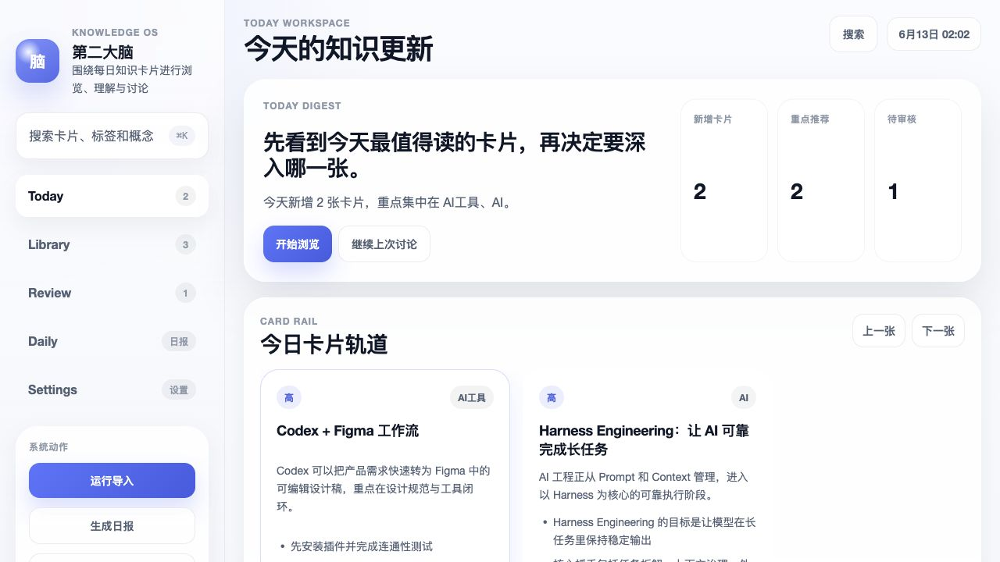
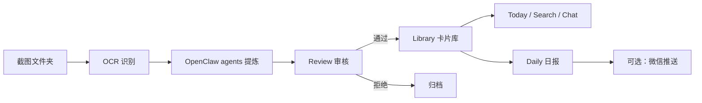
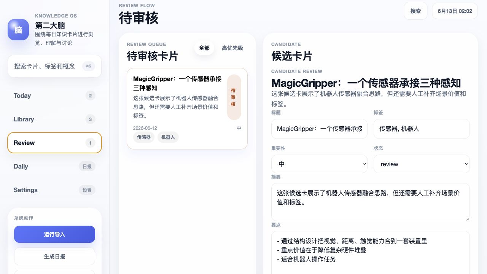
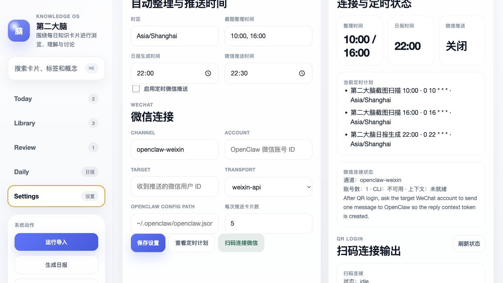
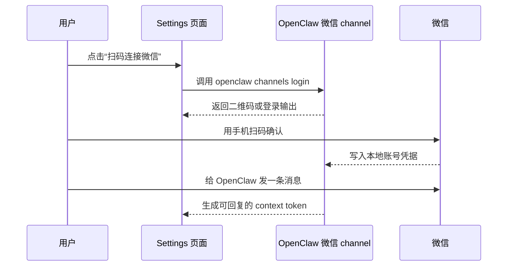

# Screenshot Second Brain

把你每天保存的截图整理成一个本地知识库：先 OCR，再由 OpenClaw agent 提炼成候选卡片，经过你审核后进入卡片库；之后可以搜索、追问、生成日报，也可以定时把精选卡片推送到微信。

这个项目适合这些场景：

- 你经常截图保存文章、聊天、课程、论文或工具说明，但后续很难找回。
- 你希望 AI 先做整理，但重要内容仍由自己审核。
- 你希望知识库和微信连接都在自己的本机配置里，不把个人内容上传到仓库。



## 你会得到什么

- **截图导入**：扫描本地截图目录，使用 macOS Vision OCR 提取文字。
- **Agent 提炼**：OpenClaw `ingest-agent` / `extract-agent` 生成结构化候选卡片。
- **人工审核**：在 Review 页修改摘要、要点、标签和重要性，再决定是否入库。
- **卡片库**：SQLite 存储 + Markdown 导出，便于本地备份和长期保存。
- **单卡追问**：围绕卡片上下文继续提问，回答带卡片引用。
- **日报**：按日期汇总当天卡片。
- **自动化设置**：在网页 Settings 页设置截图整理时间、日报时间、微信推送时间。
- **微信连接接口**：保留 OpenClaw 微信扫码连接入口，支持后续把精选卡片推送到个人微信。
- **Demo Mode**：没有模型、没有截图、没有微信配置时，也能体验完整流程。

## 使用流程



实际使用时，你主要会经过五步：

1. **准备截图目录**：把要整理的图片放进一个本地文件夹。
2. **运行导入**：点击网页里的“运行导入”，或执行 `npm run ingest`。
3. **审核候选卡片**：在 Review 页确认 AI 生成的摘要和要点。
4. **阅读和追问**：在 Today 或 Library 里浏览卡片、继续提问。
5. **设置自动化**：在 Settings 页设置整理时间和微信推送时间。



## 先跑一个 Demo

如果你只是想先看看效果，推荐用 Demo Mode。它只使用仓库里的公开样例数据，不读取你的真实截图，也不会发送微信消息。

```bash
cp .env.example .env
npm install
npm run dev
```

打开：

```text
http://127.0.0.1:3017
```

进入网页后点击“注入 Demo”，然后按这个顺序体验：

1. 打开 Review，审核一张候选卡片。
2. 回到 Today，看已发布卡片。
3. 围绕某张卡继续提问。
4. 打开 Daily，生成日报。
5. 打开 Settings，查看自动化和微信连接设置。

也可以用 Docker 体验：

```bash
cp .env.example .env
docker compose up --build
```

## 搭建自己的截图知识库

真实截图 OCR 建议在 macOS 本机运行，因为当前 OCR 脚本使用 Apple Vision framework。

要求：

- macOS
- Node.js 24 或更新版本
- OpenClaw CLI，可选；不配置时 Demo 和基础链路会走本地 fallback
- 一个本地截图目录，例如 `~/Pictures/KnowledgeScreenshots`

配置步骤：

```bash
cp .env.example .env
```

编辑 `.env`：

```bash
DEMO_MODE=false
SCREENSHOT_DIR=~/Pictures/KnowledgeScreenshots
OPENCLAW_CLI=/absolute/path/to/openclaw
OPENCLAW_MODEL=
```

启动网页：

```bash
npm run dev
```

手动导入一次：

```bash
npm run ingest
```

`OPENCLAW_MODEL` 留空时使用 OpenClaw 当前默认模型。你也可以在 OpenClaw 自己的配置里切换模型，本项目不会把模型写死。

## 设置自动整理和微信推送

打开 Settings 页，你可以直接在网页里设置：

- 截图整理时间，例如 `10:00, 16:00`
- 日报生成时间，例如 `22:00`
- 微信推送时间，例如 `22:30`
- 是否启用定时微信推送
- 微信 channel、account、target、transport 和每次推送卡片数

设置会保存到本机 `state/settings.json`。这个文件已被 `.gitignore` 忽略，不会被提交到 GitHub。



安装或预览 OpenClaw cron：

```bash
npm run scheduler:plan
npm run scheduler:install
```

## 连接个人微信

本项目不会在仓库里保存你的微信账号、target 或 token。微信连接依赖你本机 OpenClaw 的微信 channel。

推荐流程：



你也可以在终端手动运行：

```bash
openclaw plugins install "@tencent-weixin/openclaw-weixin"
openclaw channels login --channel openclaw-weixin
openclaw gateway restart
```

扫码成功后，让目标微信账号给 OpenClaw 发一条消息。这样系统才能获得回复所需的 context token，后续“推送微信”才有明确收件人。

## 项目不会上传什么

这个仓库是给别人部署工具用的，不包含你的个人知识内容。以下内容只应留在每个用户自己的机器上：

- `.env`
- `state/`
- `card-library/`
- `cards/`
- `knowledge-base/`
- `.openclaw/`
- `AGENTS.md`、`MEMORY.md`、`USER.md` 等个人工作区文件

这些路径已写入 `.gitignore` 和 `.dockerignore`。

## 常用命令

```bash
npm run dev              # 启动网页
npm run ingest           # 扫描截图并生成候选卡片
npm run demo:seed        # 注入 demo 数据
npm run demo:reset       # 重置 demo 数据
npm run scheduler:plan   # 查看定时计划
npm run scheduler:install
npm run push:preview     # 预览微信推荐内容
npm run push:wechat      # 发送微信推荐，需要本机微信通道配置
npm run check
npm test
npm run release:check
```

## 项目结构

```text
src/                 Node.js 后端、SQLite、工作流、OpenClaw agent adapter
public/              本地 Web UI
demo/fixtures/       可公开的演示数据
docs/                架构、部署、演示和 agent 规范
docs/assets/         README 页面截图
scripts/ocr.swift    macOS Vision OCR 脚本
tests/               Node test 测试
```

## 更多文档

- [Deployment Guide](./docs/deployment.md)
- [Personal Setup](./docs/personal-setup.md)
- [Demo Guide](./docs/demo-guide.md)
- [Architecture](./docs/architecture.md)
- [Agent Notes](./docs/agents/README.md)

## 发布前检查

维护者发布前建议运行：

```bash
npm run check
npm test
npm run release:check
docker build -t screenshot-second-brain .
```

再运行 `git status --ignored`，确认个人数据目录仍处于 ignored 状态。

## License

MIT
